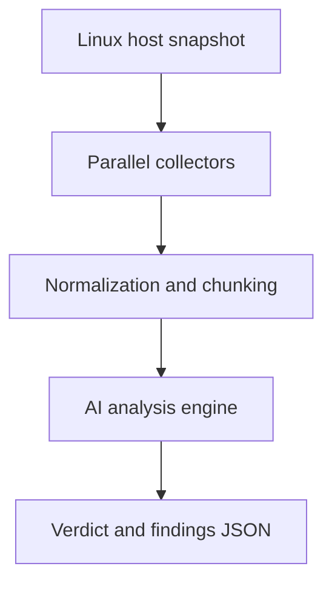

# HostTriageAI

**AI-assisted Linux host triage using high-signal telemetry**

HostTriageAI collects high-value, low-volume telemetry from a Linux host and submits it to an AI model to answer one operational question:

> **Is there anything suspicious on this host right now?**

It is designed for **incident response, threat triage, and hostile-environment validation**, not compliance, asset inventory, or generic hardening.

---

## How it works



All collectors run independently.  
**Normalization and chunking happen after collection for all signals**, not just “high-risk” ones.

---

## Design goals

- **High signal, low volume**
  Focus on telemetry attackers cannot easily hide.

- **IR-first**
  Persistence, execution, privilege, authentication, and network activity take priority.

- **Baseline inferred, not assumed**
  The AI infers what *normal* looks like for the host and context.

- **Human-verifiable**
  Every finding includes raw evidence, reasoning, and concrete next steps.

---

## What is collected

### Execution and runtime
- Root-owned processes
- Long-lived processes
- Process-backed network sockets

### Network
- Listening sockets
- Established connections with owning PID and FD context

### Persistence
- System crontab and cron directories
- User crontabs
- init.d scripts
- rc.local metadata

### Authentication and access
- Last successful logins
- Failed authentication attempts
- SSH login history
- Active sessions
- SSH daemon configuration
- Authorized SSH key metadata

### Privilege
- UID 0 users
- sudoers and sudoers.d hashes

### Artifacts
- Executable files in `/tmp` and `/dev/shm`
- Common attacker staging locations

---

## What this tool is not

- Not a vulnerability scanner  
- Not a compliance scanner  
- Not an EDR replacement  
- Not a trust-based auditor  

HostTriageAI **assumes compromise is possible** until evidence says otherwise.

---

## Example finding (high severity)

The example below is **intentionally realistic** and uses the **exact output structure** produced by the analyzer.  
Sensitive identifiers are redacted.

```json
{
  "findings": [
    {
      "severity": "high",
      "category": "network",
      "evidence": "tcp     0        0           local_host:55742     remote_host:9003   users:((\"sh\",pid=1490,fd=2),(\"sh\",pid=1490,fd=1),(\"sh\",pid=1490,fd=0))",
      "reasoning": "Established outbound connection owned by an interactive shell/interpreter (sh/bash/python/nc/socat/etc). This matches reverse shell / live C2 tradecraft and should be treated as active compromise until disproven.",
      "recommended_next_step": "1) Identify PID and parent: ps -fp <pid>; ps -o pid,ppid,user,etime,cmd -p <pid>\n2) Inspect process tree: pstree -asp <pid>\n3) Inspect /proc: readlink -f /proc/<pid>/exe; tr '\\0' ' ' < /proc/<pid>/cmdline\n4) Confirm remote: ss -tunp | grep <pid>\n5) Contain: isolate network or kill -STOP <pid> (preserve forensics) then image if needed"
    }
  ]
}
```

This class of finding should **override benign assumptions** and trigger immediate investigation.

---

## Intended use cases

- Incident response triage
- Threat hunting
- Suspicious host validation
- Cloud and ephemeral host inspection
- Developer workstation and WSL abuse detection

---

## Philosophy

> **Do not collect everything. Collect what attackers cannot hide.**

HostTriageAI is designed to surface **meaningful deviations** and **high-confidence threat signals** without drowning analysts in noise.
